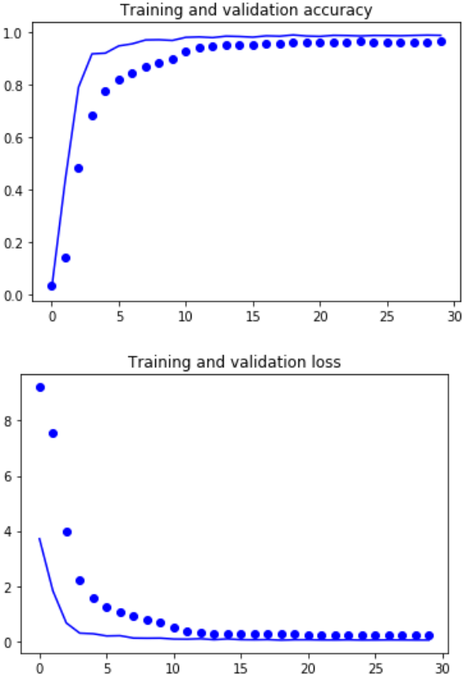
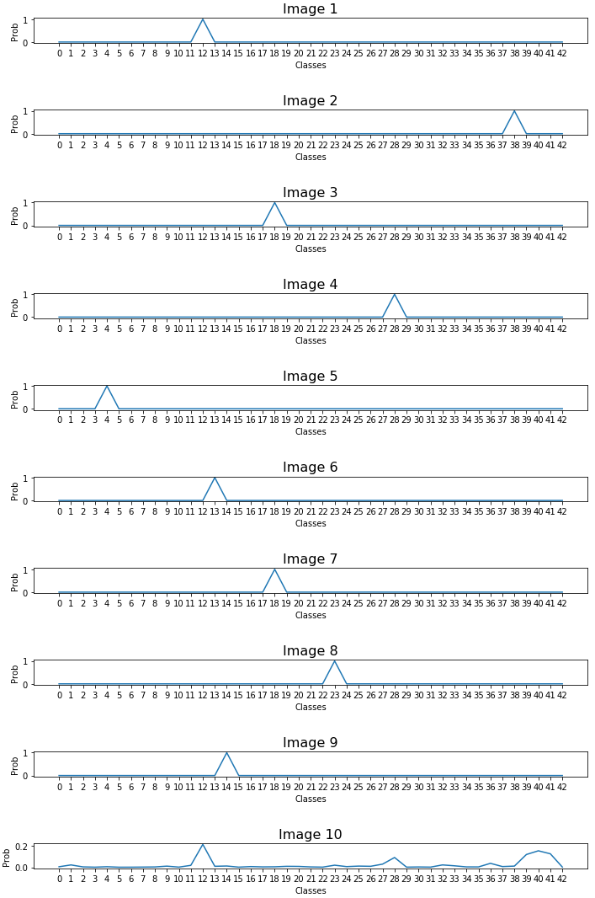

# Traffic Sign Recognition #

In this project, the knowledge about deep neural networks and convolution neuronal networks in special was applied to a real-world problem by using the framework Tensorflow.

A model was created based on the LeNet-5 architecture and then trained to classify traffic signs. For that purpose, the German Traffic Sign Dataset was used.

Afterwards, the model is tested with different traffic signs images from the web, to see how it performs in the real world.

----------

# Data Set Summary & Exploration #

**Data set summary**

I used python together with numpy to calculate summary statistics of the traffic signs data set:

* The size of training set is 34799 images
* The size of the validation set is 4410 images, that are 12.67% of the training set size
* The size of test set is 12630 images
* The shape of a traffic sign image is 32 x 32 x 3
* The number of unique classes/labels in the data set is 43

**Exploratory visualization of the dataset**

I explored the dataset by using different methods. First, I printed out a table with sign names, class IDs and counts per class for better identification:

Second, I displayed 100 random traffic signs, together with their labels below in a 10x10 grid:

Third, I showed the distribution of the data in the training set as a bar chart. It visualizes the counts per class over their class ID:

----------

# Design and Test a Model Architecture #

**Image data augmentation and pre-processing**

The training data set is very unbalanced, which means that there are sometimes only 210 examples per class, and sometimes over 2000. This could lead to the fact, that the network is biased towards those categories containing more samples.

In order to improve that situation, new image samples were created by using data augmentation. This includes randomly changing the brightness, the rotation, the translation, the transformation and adding noise to the existing samples, so that new ones can be created. By using this technique, a balanced dataset with 2500 training images per class was created:

All images from the training, validation and testing set are converted to grayscale, because the color information should not improve the performance of the network much. The following image shows 100 random images of the grayscaled, extended training set:

To normalize the data, first histogram localization is applied. Then the range of the data is normalized to 0.0 up to 1.0 and converted to 32-bit floating point numbers. The array is reshaped to size 32x32x1 to fit into the model later.

The training and validation set was already split by using the pickle data sets provided. Augmentation of the training set leads to 107500 examples, which is an increase of over 300% compared to the original data set. This should help to not underfit the model later. For the validation set, 4410 images are used to evaluate the performance during the training. Afterwards, the test set with 12630 samples is used to get the accuracy on new data.

**Model architecture**

My model is an improved version of the LeNet-5 architecture, containing more layers as well as weights and biases to allow a better fitting to the data:

Input image: 32x32x1 (grayscale + normalization)

Layer 1: 1st Convolutional with dropout. Input = 32x32x1. Output = 28x28x32

Layer 2: 2nd Convolutional with max-pool and dropout. Output = 14x14x64

Layer 3: 3rd Convolutional with max-pool and dropout. Output = 7x7x128

Flatten

Layer 4: Fully Connected with Dropout. Input = 6272. Output = 256

Layer 5: Fully Connected with Dropout. Input = 256. Output = 128

Layer 6: Fully Connected. Input = 128. Output = 43

Output: 43 values, containing the probability that the image belongs to class x

**Model training**

To train the model, I used one of the new P2 instances from Amazon EC2 AWS cloud. The p2.xlarge instance uses one Nvidia Tesla K80 accelerator, running a pair of Nvidia KG210 GPUs. Each GPU provides 12GB of memory and 2496 parallel processing cores. I installed the GPU version of Tensorflow together with CUDA there, and trained the model for several hours.

I found the following parameters to be promising:

Batch-Size: 256

Learning-Rate: 0.001

Epochs: 50

Dropout-Keep: 0.5

For initialising the weights, I did not use the truncated normal method. The reason is that for the first 5 epochs, the accuracy gets often stuck and it takes some time until the model makes progress.

Instead, I utilized the Xavier initializer. This initializer is designed to keep the scale of the gradients roughly the same in all layers. In uniform distribution this ends up being the range: x = sqrt(6. / (in + out)); [-x, x] and for normal distribution a standard deviation of sqrt(3. / (in + out)) is used. 

For the optimizer, I used the adam optimizer instead of stochastic gradient descent. Adam is an algorithm for first-order gradient-based optimization of stochastic objective functions, based on adaptive estimates of lower-order moments. The method is straightforward to implement, is computationally efficient, has little memory requirements, is invariant to diagonal rescaling of the gradients, and is well suited for problems that are large in terms of data and/or parameters.

Those plots show the loss and accuracy over time:

**Final Solution**

My final model results were:

Training set accuracy of 97.7%

Validation set accuracy of 95.9%

Test set accuracy of 93.5%

At first I tried the standard LeNet-5 architecture, but found out it was not big enough to learn all the required features. So I extended the number of feature maps and also the number of neurons in the fully connected layers. In addition, I added one more convolution layer and changed the kernel sizes. The first two convolutional layer now have a kernel size of 5x5, and the last one has a 3x3 kernel.

In order to avoid overfitting, I added dropout to all layers except for the output layer. This way, the feature maps and the neurons in the fully connected layer can learn more robust features and it also avoids overfitting. I found a dropout rate of 50% to be promising. When using the test data set and the test images, the dropout is of course deactivated by changing the run mode to test.

The batch size of 256 gives a good trade-off between speed and accuracy. After 50 epochs, the accuracy on the test and validation set did not improve much, so I decided to stop there. I did not tweak the learning rate, as I think a value of 0.001 is a good standard value that many people use together with the adam optimizer. 

I also experimented with a bigger architecture, containing more layers, more feature maps and also more single neurons. But I found out that for the given problem set, the architecture I ended with is sufficient. The bigger model would require a lot more data not to be underfitted, and I did not want to extend the data set further more.
 
----------

# Test model on new images #

**Test images**

Here are ten traffic signs that I found on the web:

They were resized to fit into the input layer (32x32x1). Two images (8th & 10th) are not german traffic signs, so it is interesting to see, how the network deals with those images.

**Model prediction**

Here are the results of the prediction:

The test accuracy on the new test data is 90.00%, while it was 93.50% on the previous test data set. This is very comparable, so no under- or overfit is estimated.

The model was able to correctly guess 9 of the 10 traffic signs. It even correctly classified the stop sign, although it was no german traffic sign. It failed to classify the 70 km/h speed limit sign, because that one differs a lot from the german version. 

**Model certainty**

For all test images except for the last one, the network is really certain about its answer. The last one was indeed classified wrong, so it makes sense that the certainty is not so high here. 

The top five predictions for the last sign are: Class 9 with 32.18%, class 17 with 16.88%, class 20 with 12.87% , class 32 with 8.53% and class 41 with 4.16%. The correct class would have been class 4, speed limit (70 km/h). It seems that the kmph letters inside the sign and the changed position of the speed limit 70 itself confuses the network. This is acceptable, as we only trained it towards german traffic signs. Using traffic sign images from different countries for the speed limit should improve this situation.