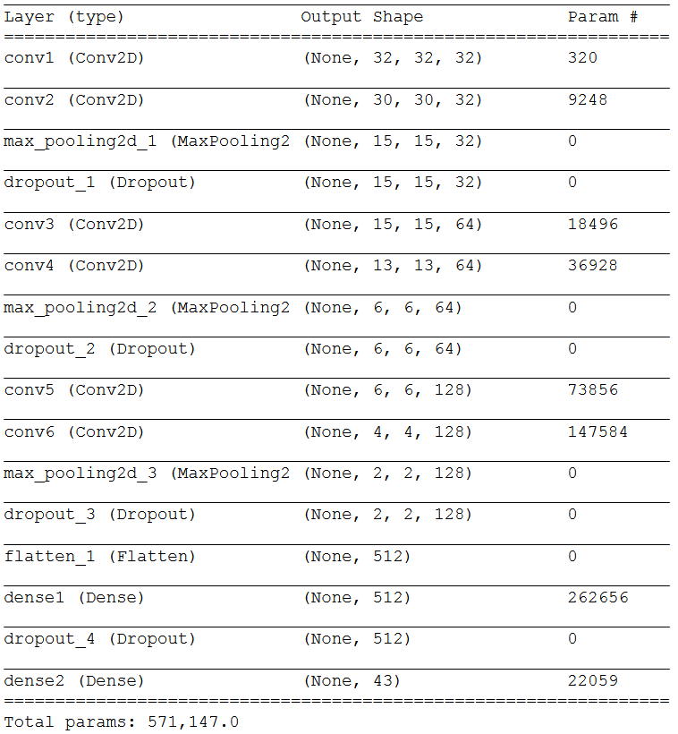
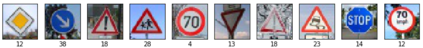

# German Traffic Sign Recognition
### Write-Up by Max Ritter

### Project description 
In this project, the knowledge about deep neural networks and convolution neuronal networks in special was applied to a real-world problem by using the deep learning Framework Keras with TensorFlow as backend. A convolutional neural network was built and then trained to classify german traffic signs. For that purpose, a dataset with over 50000 images was used.
Afterwards, the model is tested with different traffic signs images from the web, to see how it performs in the real world.

### Data Set Summary & Exploration

Data set summary:

* The size of training set is 34799 images
* The size of the validation set is 4410 images, that are 12.67% of the training set size
* The size of test set is 12630 images
* The shape of a traffic sign image is 32 x 32 x 3
* The number of unique classes/labels in the data set is 43

The different classes are:

Hera are 100 random traffic signs, together with their labels below in a 10x10 grid:

Here is a bar chart, that visualizes the counts per class over their class ID:

### Training

The training data set is very unbalanced, which means that there are sometimes only 210 examples per class, and sometimes over 2000. This could lead to the fact, that the network is biased towards those categories containing more samples. To fix this, the weight influence for each class compared to the majority class is analyzed and handed over to Keras.

All images from the training, validation and testing set are converted to grayscale, because the color information should not improve the performance of the network much. To normalize the data, the range of the data is normalized to 0.0 to 1.0, corresponding to the RGB values 0 to 255.

The training and validation set was already split by using the pickle data sets provided. Augmentation of the training set is created on-the-fly with the Keras ImageDataGenerator with various techniques like shifting, rotation, zomming, etc.

The convolutional neural network looks like this, with six convolutional layer, two fully connected layers, ReLU as activation function and Dropout for regularization:

I trained the model on my NVIDIA GTX 1080TI GPU with a batch-size of 128 samples for 30 epochs, which only took a couple of minutes. I set the maximum number of epochs to 100 and used early stopping to abort the training, when the accuracy did not make any notable progress after 10 epochs.

For initialising the weights, I utilized the Xavier initializer. This initializer is designed to keep the scale of the gradients roughly the same in all layers. In uniform distribution this ends up being the range: x = sqrt(6. / (in + out)); [-x, x] and for normal distribution a standard deviation of sqrt(3. / (in + out)) is used. 

For the optimizer, I used stochastic gradient descent with nesterov momentum, a learning rate of 0.01, a learning rate decay of 1x10^-6 and a momentum rate of 0.9. In addition to that, I added a learning rate scheduler to decrease the rate after a couple of epochs.

Those plots show the loss and accuracy over time:

### Results

My final model results are:

- Training set accuracy of 96.29% (augmented images, so harder to classify correctly!)
- Validation set accuracy of 98.62%
- Test set accuracy of 97.68%

Here are ten traffic signs that I found on the web:

They were resized to fit into the input layer (32x32x1). Two images (8th & 10th) are not german traffic signs, so it is interesting to see, how the network deals with those images.

Here are the results of the prediction:

The test accuracy on the new test data is 90.00%, which tells us that the model was able to correctly guess 9 of the 10 traffic signs. It even correctly classified the stop sign, although it was no german traffic sign, but the color information is discarded so it looks like a german one. It failed to classify the 70 km/h speed limit sign, because that one differs a lot from the german version. 

Here is the certainty of the model for each prediction and the different classes:

For all test images except for the last one, the network is really certain about its answer. The last one was indeed classified wrong, so it makes sense that the certainty is not so high here. 